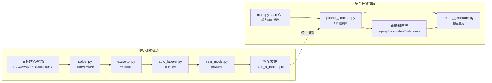

基于特征矢量的 Web 漏洞自适应探测与自动化渗透框架（V-APF, Vector-based Adaptive Penetration-testing Framework）
V-APF 将 Payload 变异与 13 维特征向量 + 随机森林决策结合，用于 SQLi / XSS 等 Web 漏洞快速发现与自动报告。

🚀 核心亮点
- AI 引擎：随机森林 + 标准化预处理，默认阈值 0.55；支持阈值平滑调优。
- 特征提取：DOM 相似度、长度差异、延迟、报错命中、反射等 13 维信号。
- 变异与并发：每个基础 payload 默认 1 个变体，`--mutation-count` 可扩展；并发默认 3，可降低抖动。
- 抗噪与 WAF 识别：弱信号/仅反射分数封顶，403/406/418/429 自动半衰；基线 status 参与降噪。
- 自动利用链：高危条目自动串行调用 sqlmap / commix / beef-xss / msfconsole（可自定义路径和超时）。
- 报告生成：HTML + PDF（Playwright 截图 + Chart.js 图表），含证据摘要与修复建议。

📊 模型表现（最新训练）
- 数据规模：训练 14848（正 6938）、测试 3713（正 1735）。
- 0.5 阈值评估：Precision 0.92 / Recall 0.96 / F1 0.94 / Accuracy 0.94；混淆矩阵 [[1838, 140], [68, 1667]]。
- 阈值调优：阈值 0.20→0.70，Recall 0.9631→0.9539，Precision 0.9202→0.9256，FP 145→133。
- 特征重要性：v4 报错命中 0.5560，v5 DOM 相似度 0.1593，v6 反射 0.1387，v1 长度差 0.1203，v2 状态变更 0.0249，其余接近 0。

🛠️ 模块总览
- 爬虫 [core/spider.py](core/spider.py)：BFS 深度 3，收集表单与 URL 参数，输出 targets.json。
- 特征提取 [core/extractor.py](core/extractor.py)：混合 httpx/Playwright 发送探测，生成 13 维特征。
- 自动打标 [core/auto_labeler.py](core/auto_labeler.py)：启发式规则（无害 payload 强制 0），产出 data/train_dataset.csv。
- 训练 [core/train_model.py](core/train_model.py)：log1p(|v1|/|v3|) + StandardScaler + RandomForest，保存模型/Scaler。
- 实战扫描 [core/predict_scanner.py](core/predict_scanner.py)：AI 评分、信号降噪、自动利用、报告落盘。
- 报告 [core/report_generator.py](core/report_generator.py)：去重、prob_effective、修复建议、HTML/PDF 产出。
- CLI 入口 [main.py](main.py)：`train` / `scan` 两个子命令一键串联。

📝 快速开始
1) 安装依赖
```
python -m pip install -r requirements.txt
python -m playwright install
```
可选：安装 sqlmap、commix、beef-xss、msfconsole 并确保在 PATH 中。

流程图（训练链路 + 扫描链路）



2) 一键训练（提取 → 合并 → 打标 → 训练）
```
python main.py train
```
默认读取 data/targets_dvwa.json、data/targets_bwapp.json、data/targets_pikachu.json，生成 data/features_all.json、data/train_dataset.csv，并在 models/ 下产出 safs_rf_model.pkl 和 scaler.pkl。

3) 实时扫描并生成报告
```
python main.py scan \
  --url "http://testphp.vulnweb.com/listproducts.php?cat=1" \
  --scan_mode combo \
  --threshold 0.55 \
  --max-payloads 50 \
  --concurrency 3 \
  --mutation-count 1 \
  --report-format both
```
常用可选项：`--deep-on-critical` 触发二次深度复验；`--deep-mode brute` 强化变异；`--report-name / --report-dir` 自定义基名与目录；`--no-headless` 便于调试；`--sqlmap-path / --commix-path / --beef-xss-path / --msfconsole-path` 覆盖可执行路径；`--exploit-timeout / --exploit-max` 控制自动利用时长与数量。

📄 报告输出
- 输出路径：reports/<sanitized_target>_YYYYMMDD_HHMMSS.html / .pdf（深度复验自动附加 _deep）。
- 内容：prob_raw/prob_effective、WAF 命中原因、信号标签、自动利用摘要（sqlmap/commix/beef/msfconsole）、证据片段、修复建议。

⚠️ 免责声明
本工具仅供安全审计与合规测试使用。请勿在未授权环境扫描，风险自负。